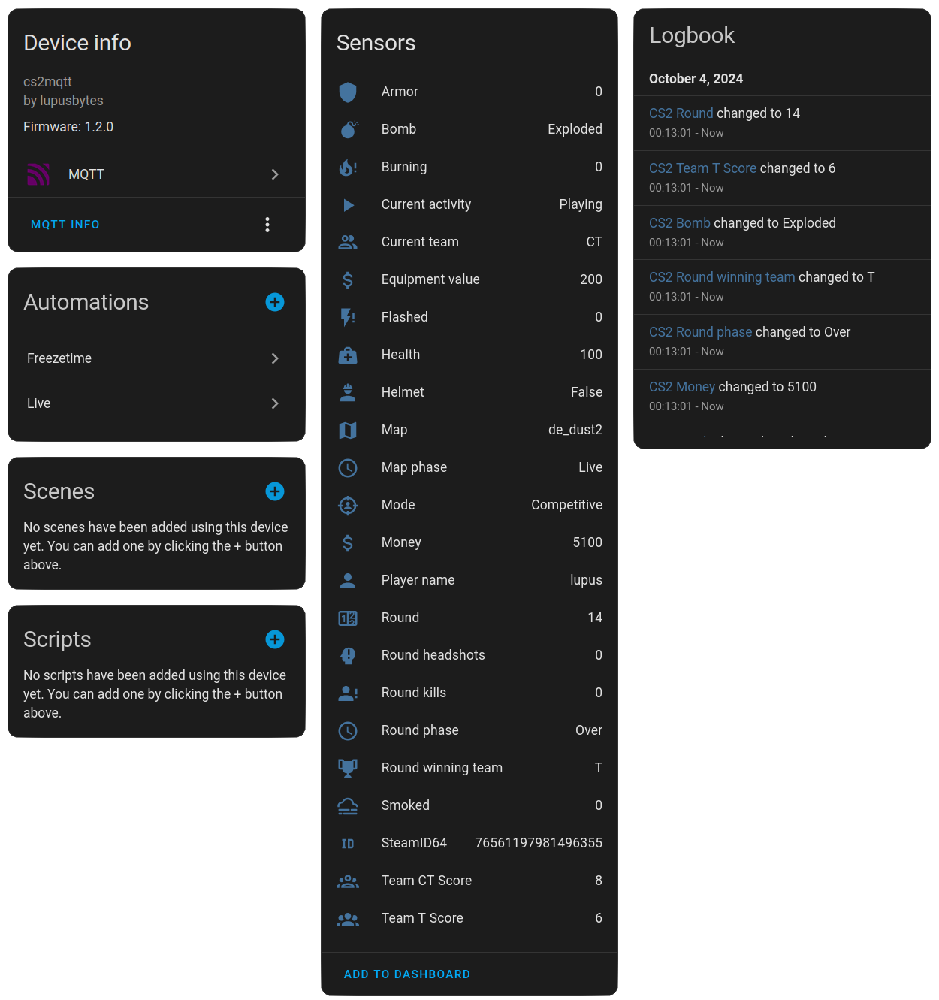

    
    
    
    
    
    

# cs2mqtt

## Introduction

This project allows you to integrate your [Counter-Strike 2](https://store.steampowered.com/app/730/CounterStrike_2/) game with [Home Assistant](https://www.home-assistant.io/) by exposing it as an [MQTT device](https://www.home-assistant.io/integrations/mqtt/).
Its purpose is to enable you to automate your smart home based on in-game events and information, enhancing your overall gaming experience.

**cs2mqtt** is cross-platform and can run locally on your gaming machine or any server device.

## Architecture
**cs2mqtt** receives its data from the built-in [Counter-Strike Game State Integration](https://developer.valvesoftware.com/wiki/Counter-Strike:_Global_Offensive_Game_State_Integration) engine. This integration is created by Valve and is safe to use and will not be flagged by anti-cheat systems such as [VAC](https://help.steampowered.com/en/faqs/view/571A-97DA-70E9-FF74) or [FACEIT](https://www.faceit.com/en/anti-cheat).

```mermaid
flowchart LR;
    CS2(Counter-Strike 2
     game instance)
    C2M(((**cs2mqtt**)))
    HA(Home Assistant
     MQTT integration)

     CS2 -- Game state data in JSON format over HTTP(s) --> C2M
     C2M -- MQTT messages --> MQTT(MQTT broker)
     MQTT --> HA
```

Internally, **cs2mqtt** keeps track of the current state of every connected Counter-Strike game instance.
Inside the Counter-Strike game, every game state change will trigger the game to send a full payload containing both the changed and unchanged state data.
**cs2mqtt** compares the received data to its in-memory cache, updates the cache accordingly, and asynchronously submits the changed data as MQTT messages to the MQTT broker.

```mermaid
flowchart LR;
    Endpoint(((**cs2mqtt**
     HTTP
     ingestion endpoint)))

    Endpoint -- Game state data --> GameStateService

    GameStateService -- Push new data to observer --> AvailabilityMqttPublisher
    GameStateService -- Push new data to observer --> GameStateMqttPublisher
    GameStateService -- Push new data to observer --> HomeAssistantDevicePublisher

    AvailabilityMqttPublisher -- Maintain availability (online/offline) for every sensor ---> MqttClient
    GameStateMqttPublisher -- Send game state data on distinct sensor topics ---> MqttClient
    HomeAssistantDevicePublisher -- Use Home Assistant MQTT device discovery protocol to automatically create Home Assistant devices and sensors for each data provider. ---> MqttClient
```

## Counter-Strike as a Home Assistant MQTT device
If the [MQTT integration](https://www.home-assistant.io/integrations/mqtt/) is installed, **cs2mqtt** will automatically create MQTT devices using the [MQTT Discovery protocol](https://www.home-assistant.io/integrations/mqtt/#mqtt-discovery), with all values configured as [sensors](https://www.home-assistant.io/integrations/sensor.mqtt/).

### System availability
On startup, when **cs2mqtt** connects to the MQTT broker, it publishes an `online` message to `cs2mqtt/status`.
It also sets a Last Will and Testament (LWT) for the MQTT broker to publish an `offline` message to this topic if it loses connection or terminates unexpectedly.
On graceful shutdown, **cs2mqtt** will publish an offline message to this topic before disconnecting.

### Device availability
When a Counter-Strike 2 game instance submits data for the first time, **cs2mqtt** will automatically create an MQTT device for it, as described above, and publish online messages to `cs2mqtt/{steamId64}/+/status` topics.
If a player disconnects from a game server, the topics related to `player_state`, `map`, and `round` will immediately be set to `offline`.
When a player closes their Counter-Strike 2 game, there is no data transmitted, and there's nothing to indicate they've quit. As a result, **cs2mqtt** listens for heartbeats and eventually sets the entire device to an offline availability state once the timeout is reached.
